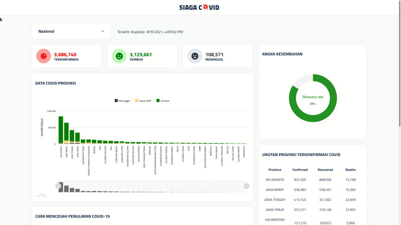

<br />
<p align="center">
  <a href="#">
    
  </a>

<h1 align="center">SIAGA COVID</h1>

  <p align="center">
    A website to show latest COVID-19 data in Indonesia.
  </p>
</p>

## Features :
- Display latest COVID-19 data (confirmed, recovered, deaths) from all region in Indonesia
- Search specific region data
- Radial Bar Chart to show recovery rate
- XY Chart to show more info from each region
- Top region affected by COVID-19

## Run Locally

Clone the project

```bash
  git clone https://github.com/alfidh02/siaga-covid.git
```

Go to the project directory

```bash
  cd siaga-covid
```

Install dependencies

```bash
  npm install
```

Start the server

```bash
  npm run start-dev
```

## Lessons Learned
The website is intended for final submission on Dicoding course too, thus things that I have learned and implemented during the project is :
- [x] Make use of ES6 standard on writing JavaScript code (Arrow Function, Class, Promise, Module, etc.)
- [x] Utilize Web Component for custom element
- [x] Using Webpack as module bundler for production stage and as an environment on development stage
- [x] Utilize AJAX on displaying dynamic data from API


## Acknowledgements

 - [API COVID-19 Indonesia](https://github.com/Reynadi531/api-covid19-indonesia-v2)
 - [Boxicons](https://boxicons.com)
 - [ApexCharts.js](https://apexcharts.com)
 - [amCharts](https://amcharts.com)

  

  
